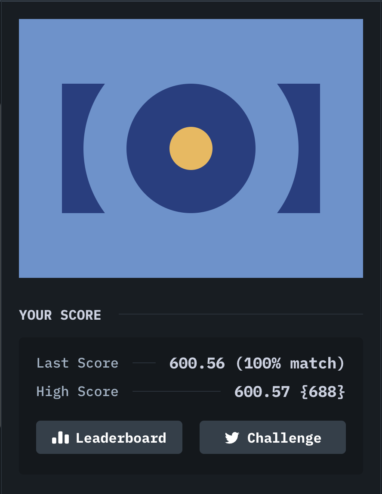

# [#3. Push Button](https://cssbattle.dev/play/3)

## Target


## My solution

```html
<div class='rectangle'>
  <div class='circle'>
    <div class='disc'>
      <div class='inner'></div>
    </div>
  </div>
</div>

<style>
  body, div:not(.rectangle) {
    display: grid;
    place-items: center;
  }
  
  body {
    background: #6592CF;
  }
  
  .rectangle {
    width: 300px;
    height: 150px;
    background: #243D83;
  }
  
  div:not(.rectangle) {
    border-radius: 50%;
  }

  .circle {
    background: #6592CF;
    height: 250px;
    width: 250px;
    margin-left: 25px;
    margin-top: -50px;
  }
      
  .disc {
    background: #243D83;
    height: 150px;
    width: 150px;
  }

  .inner {
    background: #EEB850;
    width: 50px;
    height: 50px
  }
</style>
```


