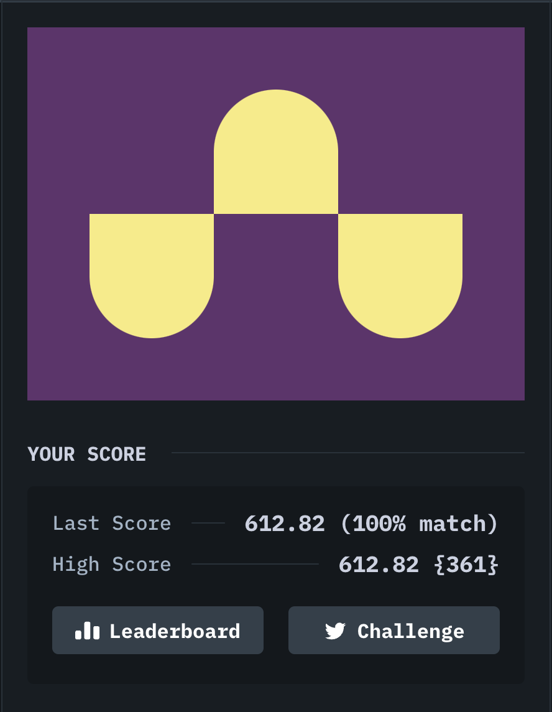

# [#4. Ups n Downs](https://cssbattle.dev/play/4)

## Target


## My solution

```html
<div></div>
<div></div>
<div></div>

<style>
  body {
    background: #62306D;
    display: flex;
    justify-content: center;
    align-items: center;
  }
  div {
    width: 100px;
    height: 100px;
    background: #F7EC7D;
    border-radius: 0 0 100vw 100vw;
    margin-top: 100px;
  }
  div:nth-child(2) {
    scale: -1;
    margin-top: -100px;
  }
</style>
```


